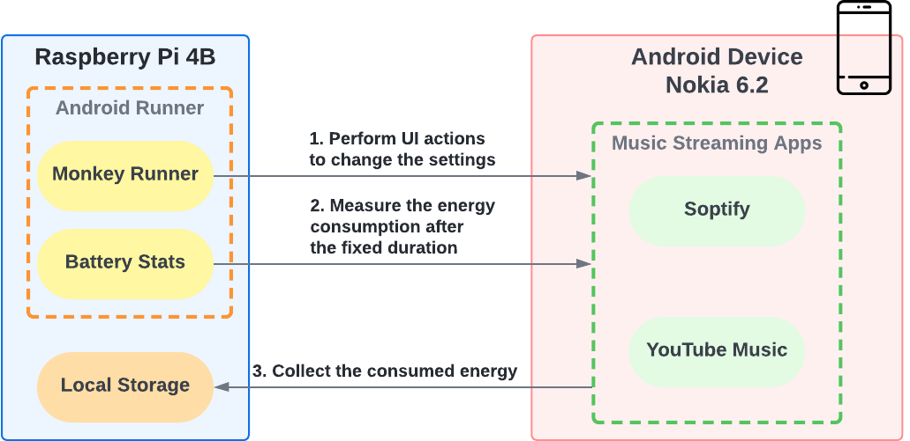

# Energy Consumption on Spotify and YouTube Music 

In this research we conduct an empirical experiment to measure the energy consumption of two music streaming applications Spotify and YouTube Music on the Android mobile device. Apart from the general comparison of energy consumed per app, we analyze three energy-consuming factors to see if they have significant impacts on the energy consumption, namely: (1) connection type (i.e., Wi-Fi streaming vs. downloaded file playing), (2) sound volume (i.e., low, medium, and high), and (3) audio quality (i.e., low, normal, high, very high). 

# Experiment Workflow and Infrastructure

    

# Files Description
`spotify`,  `ytmusic`:

Python and monkey-runner scripts for interaction

(i.e., clear app data, login, set quality, set volume, enable or disable wifi , and play the music)

`r`:

- `split.py`: Python scripts for data preprocessing

- `music.R`: R scripts for data analysis

- `data`: raw data 

- `Latex`: Latex source of the written report

# Run the Experiment
- Data Collection: Put youtube music and spotify apps in the home directory of raspberry pi, then run `sh run.sh` 30 times

- Data Analysis: First run `split.py`, then run `music.R`